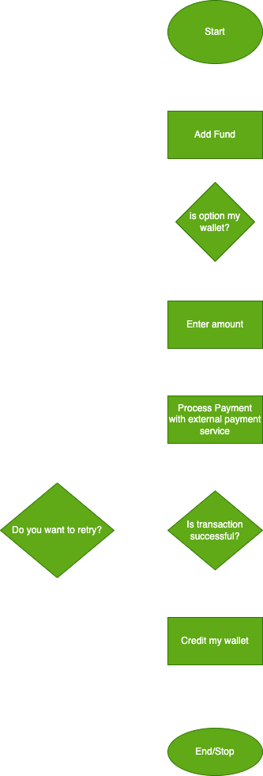

# List Of Services

## User Management Service (UMS)

The UMS is the service used for managing users data, validation, authentication and verification of the said data.

### User Models

- The user models is used to define the domain logic for the user data. It is used to handled the type and structure of data passed between the database and the application.

## Payment Service (PS)

- The PS is a service used for carrying out financial transactions. It houses the functionalities of Wallet.

### Wallet Model

- This model is used to handle user funds. This model consist of functions, interfaces and the Wallet schema. The wallet is powered and integrated to Monnify. Monnify is a payment service that help us keep our escrow account and is used to keep track of our users wallet funds.

## Wallet Functionalities

Below are functionalities that makes up the wallet

### Add Funds

- This is the process in which a user can credit their wallet from their bank account. Below is a flow of the process:

### Transfer

- This is the process in which a user sends money out of their wallet either as a transfer to another wallet user on the platform, external personal bank account or a recipient with other bank details. Withdrawals can also be in form of payment for purchases of utilities, pension and tax payments.

### Withdrawal

- This is the process in which a user sends money out of their wallet either as a transfer to another wallet user on the platform, external personal bank account or a recipient with other bank details. Withdrawals can also be in form of payment for purchases of utilities, pension and tax payments.

# Application Data Flow

